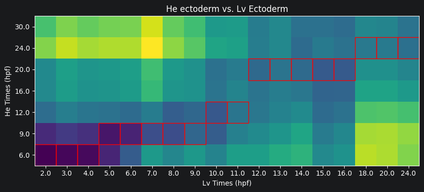
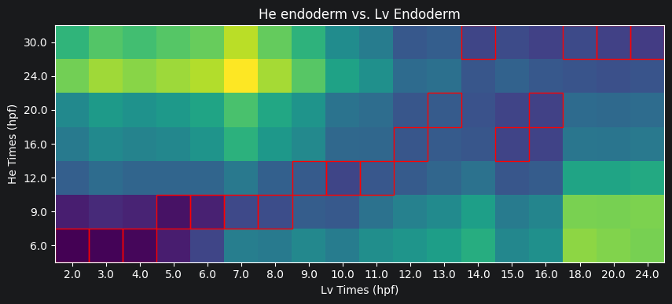
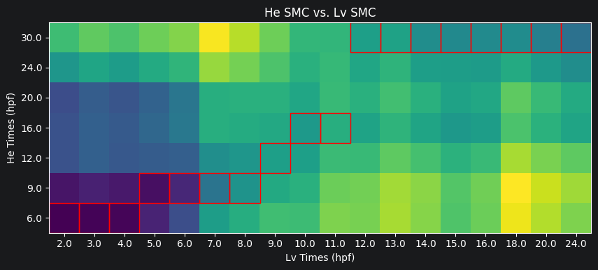
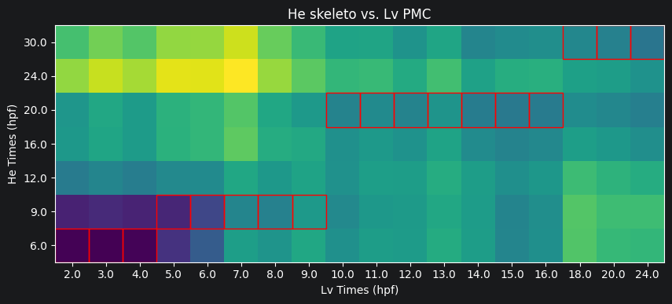
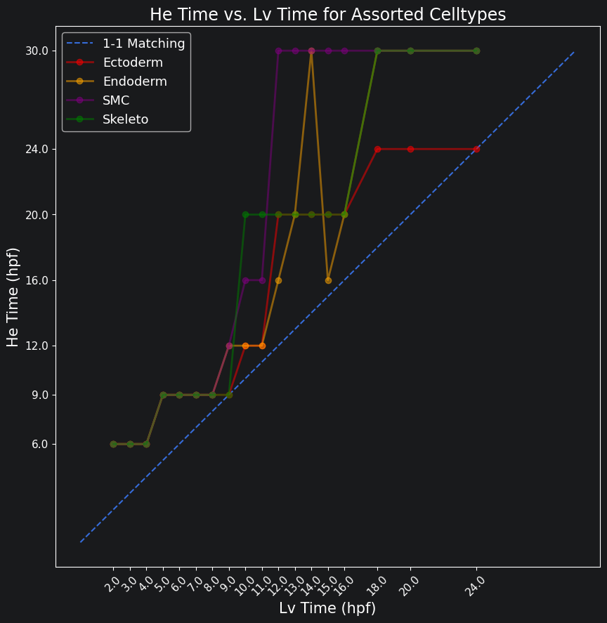

# Celltype Timing Alignment Between Sea Urchin Species

This post is a jupyter notebook that shows an analysis I did on two species of sea urchin. For this analysis, I wanted
to see whether we can use scRNA-seq data to predict developmental timing differences between the two species. Turns out,
this is a pretty reasonable goal. Follow along with the notebook below, and you can check out how the developmental times
align.

The goal of this notebook is to analyze developmental timings between two sea urchin species: *Lytechinus variegatus* (Lv) and *Heliocidaris erythrogramma* (He). As starting data, we use the time courses featured in
[Developmental single-cell transcriptomics in the Lytechinus variegatus sea urchin embryo](https://journals.biologists.com/dev/article/148/19/dev198614/272307/Developmental-single-cell-transcriptomics-in-the?guestAccessKey=)
and
[Single-Cell Transcriptomics Reveals Evolutionary Reconfiguration of Embryonic Cell Fate Specification in the Sea Urchin Heliocidaris erythrogramma](https://academic.oup.com/gbe/article/17/1/evae258/7908551). Using gene orthologs, we can make these two different species comparable to each other. This lets us use Optimal Transport (OT) to calculate the distances between the various celltypes at through the developmental process. [Waddington-OT](https://broadinstitute.github.io/wot/tutorial/) even lets us take this comparison to before those cell types even initially exist by comparing ancestors relative to the final time point. The end result let us compare developmental speeds between cell types and is essentially the analysis from Figure 3a and 3b of the He paper.
Note, the preview picture is actually of *Heliocidaris erythrogramma* from this [iNat observation](https://www.inaturalist.org/observations/207128098).

## Load Data

Read data in from directories and strip any information we don't need to use. We expect gene expression data to already be saved as pre-processed anndata files. We also expect a text file of ortholog gene names. The orthologs file should have on each line a Lv gene name and a matching He gene name.


```python
import wot
import numpy as np
import pandas as pd
import anndata
import matplotlib.pyplot as plt
import matplotlib.patches as patches

from tqdm.notebook import tqdm
import gc
import pickle
```


```python
DATA_PATH = 'data/'
HE_EXP_PATH = DATA_PATH + 'He/He_adata_SCT.h5ad'
HE_TMAP_PATH = DATA_PATH + 'tmap/he-0606/'
LV_EXP_PATH = DATA_PATH + 'annotation/Lv_Braker_adata_SCT.h5ad'
LV_TMAP_PATH = DATA_PATH + 'tmap/lv-braker-0510/'

ORTHOLOG_PATH = DATA_PATH + 'annotation/Lv_He_orthologs.txt'

#Set the final timepoint
T_FINAL_HE = 30
T_FINAL_LV = 24
```


```python
def load_datasets(adata_path, tmap_path):
    # Loads the anndata and transport maps for an urchin
    adata = anndata.read_h5ad(adata_path)
    adata.X = adata.X.toarray()
    adata.obs = adata.obs[['orig.ident', 'hpf', 'subtype', 'type', 'umap_x', 'umap_y']]
    adata.obsm.clear()
    adata.uns.clear()

    # Restrict to highly variable genes
    adata = adata[:, adata.var['sct.variable']].copy()

    tmap_model = wot.tmap.TransportMapModel.from_directory(tmap_path)
    gc.collect()
    return adata, tmap_model

adata_He, tmap_model_He = load_datasets(HE_EXP_PATH, HE_TMAP_PATH)
adata_Lv, tmap_model_Lv = load_datasets(LV_EXP_PATH, LV_TMAP_PATH)

# Load gene orthologs
orthologs = pd.read_csv(ORTHOLOG_PATH, index_col=0, sep=' ', header=None)
```

## Restrict to Orthologs

We need to make sure that the expression spaces for each curve are compatible. To do this, we should match genes in one species with their orthologs in the other. After doing this, we will be able to compute distances.


```python
# Remove common names from the index and reformat them to the ortholog matching names
adata_Lv.var['LVA_name'] = adata_Lv.var['id'].apply(lambda x: x.split(':')[0])
adata_Lv.var['LVA_name'] = adata_Lv.var['LVA_name'].apply(lambda x: x.replace('-', '_'))

adata_Lv.var = adata_Lv.var.set_index('LVA_name')

# Do the same for He
adata_He.var['id'] = adata_He.var.index
adata_He.var['He_name'] = adata_He.var['id'].apply(lambda x: x.split(':')[0])
adata_He.var['He_name'] = adata_He.var['He_name'].apply(lambda x: x.replace('-', '_'))

adata_He.var = adata_He.var.set_index('He_name')
```


```python
# Restrict orthologs to only entries shared with Lv
orthologs_Lv = list(set(orthologs.index).intersection(set(adata_Lv.var.index)))
orthologs = orthologs.loc[orthologs_Lv, :].copy()

# Now restrict further to only entries shared with He
orthologs = orthologs.reset_index()
orthologs = orthologs.set_index(1)
orthologs_He = list(set(orthologs.index).intersection(set(adata_He.var.index)))
orthologs = orthologs.loc[orthologs_He, :].copy()
```


```python
# Make the indexing easier now that orthologs is fixed
orthologs = orthologs.reset_index()
orthologs = orthologs.rename(columns={1: 'He', 0: 'Lv'})
```


```python
# Restrict adatas to orthologs
adata_Lv = adata_Lv[:, orthologs['Lv']].copy()
adata_Lv.var['ortho_Lv'] = list(orthologs['Lv'])
adata_Lv.var['ortho_He'] = list(orthologs['He'])

adata_He = adata_He[:, orthologs['He']].copy()
adata_He.var['ortho_Lv'] = list(orthologs['Lv'])
adata_He.var['ortho_He'] = list(orthologs['He'])
gc.collect()
```


    772


## Create Trajectories for Celltypes

We will create trajectories for celltypes by pushing each terminal type back through all timepoints. This is what allows us to compare the development of a celltype before it exists.


```python
# Make final populations for He
cellsets_He = {}

# Make cell sets for He
for celltype in adata_He.obs.type.unique():
    final_ids = list(adata_He.obs[(adata_He.obs.type == celltype) & (adata_He.obs.hpf == T_FINAL_HE)].index)
    cellsets_He[celltype] = final_ids
    
populations_He = tmap_model_He.population_from_cell_sets(cellsets_He, at_time=T_FINAL_HE)

# Make final populations for Lv
cellsets_Lv = {}

# Make cell sets for Lv
for celltype in adata_Lv.obs.type.unique():
    final_ids = list(adata_Lv.obs[(adata_Lv.obs.type == celltype) & (adata_Lv.obs.hpf == T_FINAL_LV)].index)
    cellsets_Lv[celltype] = final_ids
    
populations_Lv = tmap_model_Lv.population_from_cell_sets(cellsets_Lv, at_time=T_FINAL_LV)
```


```python
# Construct trajectories for both
trajectories_He = tmap_model_He.trajectories(populations_He)
trajectories_Lv = tmap_model_Lv.trajectories(populations_Lv)

# Restrict to only times we're interested in
trajectories_He = trajectories_He[trajectories_He.obs.day <= T_FINAL_HE].copy()
trajectories_Lv = trajectories_Lv[trajectories_Lv.obs.day <= T_FINAL_LV].copy()
```

## Find Distances Between Trajectories

We will now find [Earth mover's distances](https://en.wikipedia.org/wiki/Earth_mover%27s_distance) between each celltype at each time. The Earth mover's distance lets us see which timepoints appear the most similar for the celltype.


```python
# Comparisons to make He -> Lv
COMPARISONS = [['ectoderm', 'Ectoderm'], ['endoderm', 'Endoderm'], ['SMC', 'SMC'], ['skeleto', 'PMC']]
```


```python
dists_dict = {}

# Get valid times for He and Lv
times_He = np.sort(list(trajectories_He.obs.day.unique()))
times_Lv = np.sort(list(trajectories_Lv.obs.day.unique()))

with tqdm(total=len(COMPARISONS)*len(times_He)*len(times_Lv)) as pbar:
    for comparison in COMPARISONS:
        # Store the comparison as typeHE_typeLV
        t_He = comparison[0]
        t_Lv = comparison[1]
        key = t_He + '_' + t_Lv

        overall_dists_comparison = []

        # Get the distance between each pair of timepoints
        for time_He in times_He:
            dists_time_He = [] # The distances between this timepoint and all Lv timepoints

            cells_He = trajectories_He[trajectories_He.obs.day==time_He, t_He].obs.index
            weights_He = trajectories_He[trajectories_He.obs.day==time_He, t_He].X.flatten()
            exps_He = adata_He[cells_He, :].X

            for time_Lv in times_Lv:
                cells_Lv = trajectories_Lv[trajectories_Lv.obs.day==time_Lv, t_Lv].obs.index
                weights_Lv = trajectories_Lv[trajectories_Lv.obs.day==time_Lv, t_Lv].X.flatten()
                exps_Lv = adata_Lv[cells_Lv, :].X

                # Get the Earth mover's distance weighted by the trajectory probabilities
                dist = wot.ot.earth_mover_distance(exps_He, exps_Lv, weights1=weights_He, weights2=weights_Lv)
                dists_time_He.append(dist)

                # Update progress bar
                pbar.update(1)

            overall_dists_comparison.append(dists_time_He)

        dists_dict[key] = overall_dists_comparison
```


      0%|          | 0/504 [00:00<?, ?it/s]


```python
# If running this notebook multiple times, you may want to save or load computed distances
pickle.dump(dists_dict, open("celltype_dists.p", "wb"))
# dists_dict = pickle.load(open("celltype_dists.p", "rb"))
```

## Plot the Distances Between Celltypes

Now we can plot the Earth mover's distances between the celltypes. A low distance suggests the most similarity. For each Lv timepoint we highlight the He timepoint with the lowest distance in red. Paying attention to the Lv developmental times on the x-axis and He developmental times on the y-axis, we can see that Lv generally develops faster than He. That is, for a given celltype, an Lv timepoint is most similar to a He timepoint at a later time.


```python
for comparison in COMPARISONS:
    # Store the comparison as typeHE_typeLV
    t_He = comparison[0]
    t_Lv = comparison[1]
    key = t_He + '_' + t_Lv
    dists_mtx = np.array(dists_dict[key])
    
    # Plot the distance matrix
    plt.figure(figsize=(10, 10))
    plt.title(f'He {t_He} vs. Lv {t_Lv}')
    ax = plt.imshow(dists_mtx, origin='lower')
    
    # Set the xticks and yticks as Lv and He timepoints respectively
    times_He = np.sort(list(trajectories_He.obs.day.unique()))
    times_Lv = np.sort(list(trajectories_Lv.obs.day.unique()))
    plt.xticks(range(len(dists_dict[key][0])), labels=times_Lv)
    plt.yticks(range(len(dists_dict[key])), times_He)
    
    plt.xlabel('Lv Times (hpf)')
    plt.ylabel('He Times (hpf)')
    
    # For each Lv time select the minimum cell and highlight it
    for i in range(dists_mtx.shape[1]):
        min_He_time = np.argmin(dists_mtx[:, i])
        
        rect = patches.Rectangle((i-0.5, min_He_time-0.5), 1, 1, 
                                 linewidth=1, edgecolor='r', facecolor='none')
        
        ax = plt.gca()
        ax.add_patch(rect)
    plt.show()
```


    

    


    

    


    

    


    

    


# Make a Scatter Plot of Minimum Times

Plot all best time matches on a scatter plot. This will let us view the different timings between all the celltypes.


```python
plt.figure(figsize=(10, 10))

plt.title('He Time vs. Lv Time for Assorted Celltypes', fontsize=17)
plt.xlabel('Lv Time (hpf)', fontsize=15)
plt.ylabel('He Time (hpf)', fontsize=15)

# Set the xticks and yticks as Lv and He timepoints respectively
times_He = np.sort(list(trajectories_He.obs.day.unique()))
times_Lv = np.sort(list(trajectories_Lv.obs.day.unique()))
plt.xticks(times_Lv, labels=times_Lv, rotation=45, fontsize=11)
plt.yticks(times_He, times_He, fontsize=11)

# Plot the baseline 1-1 alignment
one_one_alignment = np.linspace(0, np.max(times_He), 30)
plt.plot(one_one_alignment, one_one_alignment, '--')

celltypes_legend = []
colors = ['red', 'orange', 'purple', 'green']

# Now go through and get the minimum times for each celltype
for j, comparison in enumerate(COMPARISONS):
    min_He_times = []
    
    # Store the comparison as typeHE_typeLV
    t_He = comparison[0]
    t_Lv = comparison[1]
    key = t_He + '_' + t_Lv
    
    dists_mtx = np.array(dists_dict[key])
    
    if t_He == 'SMC':
        celltypes_legend.append('SMC')
    else:
        celltypes_legend.append(t_He.capitalize())
    
    # For each Lv time get the minimum He time
    for i in range(dists_mtx.shape[1]):
        min_He_time_ind = np.argmin(dists_mtx[:, i])
        min_He_time = times_He[min_He_time_ind]
        min_He_times.append(min_He_time)
        
    # Now plot the alignment for the celltype
    plt.plot(times_Lv, min_He_times, color=colors[j],
             marker='o', linestyle='-', linewidth=2, alpha=0.5)

plt.legend(['1-1 Matching'] + celltypes_legend, fontsize=13)
plt.show()
```



