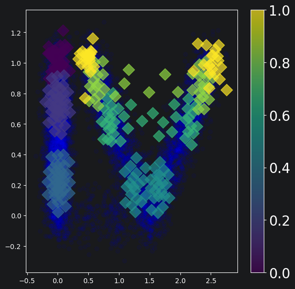

# Fitting Wasserstein Principal Curves

In this notebook, we will work through an example of how to use Wasserstein Principal Curves on a dataset. Briefly, Wasserstein Principal Curves take [Hastie's original idea](https://hastie.su.domains/Papers/Principal_Curves.pdf) of a curve that runs through the middle of a dataset and adapt it into Wasserstein space (probability space). See our [paper](https://arxiv.org/abs/2505.04168) on the topic. This space naturally embeds objects like scRNA-seq time series. That is, a timepoint can be seen as a probability distribution on collected cell profiles $X_t = \sum_i \delta_{x_{t, i}}$. Fitting a principal curve through these datasets gives us a simple representation of them in terms of knots. Importantly, we can also use this representation to order (seriate) timepoints, and even assign them a pseudotime. This notebook uses a simulated dataset that models branching cell differentiation, with a poorly sampled area of rapid growth in the middle.

```python
from pcurves import WasserPoint, PrinCurve
import data_gen_utils, data_analysis_utils
import numpy as np
import matplotlib.pyplot as plt
```

```python
# Configure dataset-specific parameters
num_times = 250
variance = 0.01
total_cells = 10000

# Fitting parameters
beta = 0.0022372575344213456
h = 0.009016857031155375
num_knots = 7
tolerance = 0.0001
enforce_endpoints = True
boundary_condition = 'open'
threads = 25
epsilon = 0.05
max_iters = 25
```

## Generate a Curve
Generate a curve according to the following formula.


$$
    \mu_t = \begin{cases}
        \delta_{(0, 1-t)} & 0 \leq t \leq 1 \\
        \delta_{\frac{t-1}{0.1}(1.5, 0)} & 1 \le t \leq 1.1 \\
        \frac12 \delta_{(t-1.1) \big(-1, 1 \big) + (1.5, 0)} + \frac12 \delta_{(t-1.1) \big (1, 1 \big ) + (1.5, 0)} & 1.1 \le t \leq 2.1. \\
    \end{cases}
$$


```python
# Generate a full dataset with more times than needed and then downsample to our required number of times
T = np.max([num_times, 2000])
N = total_cells // num_times

x = data_gen_utils.generate_branching_curve_bent(T=T, N=N, variance=variance)
x_ds, selected_inds = data_analysis_utils.downsample_data(num_times, T, total_cells, x)

# Convert to Wasserstein space
points_list = [WasserPoint(point, np.ones(len(point)) / len(point)) for point in x_ds]
```

## Fit the Curve

This optimizes the $\text{PPC}_\omega^K$ objective from the paper. You may get some convergence warnings from the Sinkhorn solver. These rely on an internal tolerance that can be too strict for some iterations. It is generally not worthwhile to change it as it doesn't affect overall convergence. We hide them here for the sake of readability.

```python
fitter = PrinCurve(epsilon=epsilon, num_knots=num_knots, h=h)
curve, dists, objective = fitter.fit(
    points_list,
    n_eval=50,
    beta=beta,
    tol=tolerance,
    num_iters=max_iters,
    save_dir=None,
    plot_interval=None,
    enforce_endpoints=enforce_endpoints,
    threads=threads,
    boundary_condition=boundary_condition
)
```

    Fitting curve with epsilon=0.05, alpha=0.009016857031155375, knot_constant=0.0022372575344213456, tol=0.0001
    Delta square dist -inf and delta full cost -inf
    Delta square dist -6.059844326577913 and delta full cost -0.38134862648916035
    Delta square dist -0.8514448612900196 and delta full cost -0.0529778148054898
    Delta square dist -0.2280052413445901 and delta full cost -0.014012245648421962
    Delta square dist -0.1084597129656224 and delta full cost -0.006480745807986077
    Delta square dist -0.0479218765166145 and delta full cost -0.002923173396563561
    Delta square dist -0.012264911480720286 and delta full cost -0.0006844000922470173
    Delta square dist -0.07559763024111987 and delta full cost -0.004832223478450137
    Delta square dist -0.01650965203362631 and delta full cost -0.0011195092972584586
    Delta square dist -0.03771857282863067 and delta full cost -0.0023701854390187904
    Delta square dist -0.038915492190973566 and delta full cost -0.0025368666421121677
    Delta square dist -0.07173884170617484 and delta full cost -0.004714356895335836
    Delta square dist -0.07139782103501346 and delta full cost -0.004670885291207627
    Delta square dist -0.08470553117421531 and delta full cost -0.005398062449376573
    Delta square dist -0.03704245832441444 and delta full cost -0.0024855824901759416
    Delta square dist -0.003470121373478463 and delta full cost -0.0002593705393663104
    Delta square dist -2.2637027306871005e-05 and delta full cost -1.3960330973450397e-06
    Converged!
    

## Plot the curve over the ground truth
The curve is a linear interpolation of its knots. To represent the curve, we can plot its knots (diamonds colored based on ordering) over the ground truth (blue).

```python
plt.figure(figsize=(7, 7))

# Collect enough data points to represent the ground truth
data_points = []

for ind, data_point in zip(selected_inds, x_ds):
    size_cutoff = 100

    if data_point.shape[0] > size_cutoff:
        pts = data_point[:size_cutoff, :2]
    else:
        pts = data_point[:, :2]

    data_points.append(pts)

data_points = np.vstack(data_points)

plt.scatter(data_points[:, 0], data_points[:, 1], alpha=0.05, color='blue')

# Plot curve knots
knot_x, knot_y, knot_c = [], [], []

for i, knot in enumerate(curve.knots):
    knot_x.append(knot.data[:, 0])
    knot_y.append(knot.data[:, 1])
    knot_c.append(np.repeat(i, knot.data.shape[0]))

knot_x = np.concatenate(knot_x)
knot_y = np.concatenate(knot_y)
knot_c = np.concatenate(knot_c)
knot_c = knot_c / np.max(knot_c)

colors = plt.scatter(knot_x, knot_y, c=knot_c, s=150, alpha=0.7, marker='D')

# Make a colorbar
cbar = plt.colorbar(colors)
cbar.ax.tick_params(labelsize=20)
plt.show()
```
    


## Perform Seriation
Now that we've fit a curve to our data, we can seriate it. Note that in general, you'll want to make sure you have good parameters before this step. A warm start initialization can also improve seriation performance. Finally, it can help to run many restarts of the algorithm and choose the best by a metric such as squared distance to the knots.

```python
# Find the pseudo-times of our points
lambdas = curve.project_points(points_list, threads=threads)

# Establish a ground truth ordering
true_ordering = np.argsort(selected_inds)
ordering = np.argsort(lambdas)

# Compute Kendall Tau Error
error_pcurve = data_analysis_utils.normalised_kendall_tau_distance(ordering, true_ordering)
print(f'The Normalized Kendall Tau error for this run was {error_pcurve}')
```
    The Normalized Kendall Tau error for this run was 0.016610441767068274

