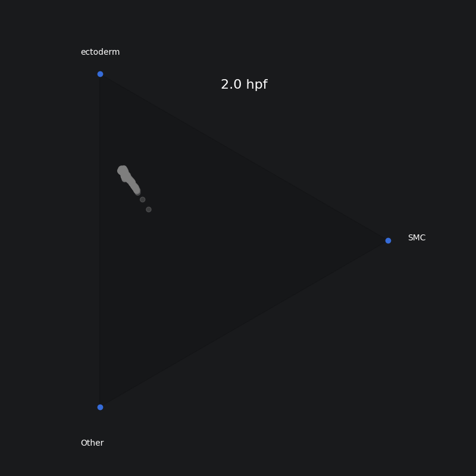

# Modeling Gene Divergence Using Optimal Transport

Using Waddington-OT (WOT) we can take cell types at a final timepoint and trace them back through time. At each of the previous timepoints, we'll have a set of probabilities for each cell. These probabilities dictate the likelihood of the cell differentiating into each of the final cell types. We can represent cell fates in [barycentric coordinates](https://en.wikipedia.org/wiki/Barycentric_coordinate_system) to easily visualize their likely fates. Coloring these cells by gene expression can show us how gene expression changes as cells differentiate. We'll look at this idea in [*Lytechinus variegatus* (Lv) sea urchin](https://journals.biologists.com/dev/article/148/19/dev198614/272307/Developmental-single-cell-transcriptomics-in-the?guestAccessKey=).


```python
import numpy as np
import matplotlib.pyplot as plt
import anndata
import wot
import math
from matplotlib.animation import FuncAnimation
from matplotlib.animation import PillowWriter
from IPython.display import HTML
```


```python
DATA_PATH = 'data/'
TMAP_PATH = DATA_PATH + 'tmap/loom-0925/'
DATA_RAW_PATH = DATA_PATH + 'anndata/adata_raw_0925_loom.h5ad'

#Set the time
T=24

# Specify which celltype and genes we want to plot
type1 = 'SMC'
type2 = 'ectoderm'
gene = 'L-var-08961:Sp-Bra'
```


```python
# Load anndata with gene expression
adata = anndata.read_h5ad(DATA_RAW_PATH)
adata.X = adata.X.toarray()
adata.uns.clear()

# Create a cell types dictionary
types = ['endoderm', 'ectoderm', 'SMC', 'PMC', 'PGC', 'other']
cell_sets = {}
for t in types:
    cell_sets[t] = list(adata.obs.index[adata.obs.type == t])
```


```python
# Load raw tmaps
tmap_model = wot.tmap.TransportMapModel.from_directory(TMAP_PATH)

# Calculate fates for our cell sets
type_target_destinations = tmap_model.population_from_cell_sets(cell_sets, at_time=T)
type_fate_ds = tmap_model.fates(type_target_destinations)
type_fate_ds.obs = type_fate_ds.obs.join(adata.obs)
```

## Make an Animation of Triangle Plots Over Development

Here we'll create our triangle plots for each early time point and look at the Endoderm cell type vs. the Secondary Mesenchyme Cell (SMC) type. We'll color the plot by the brachyury (bra) gene. Brachyury is highly involved in endoderm (gut) formation. Meanwhile, we should see almost no bra in SMC cells. Finally, we should see some bra in cells fated towards other cell types since bra is also involved in the formation of the mouth (ectoderm).


```python
def project_fates_bary(hour, cell_type1, cell_type2):
    '''
    Project cell fates to barycentric coordinates for plotting.
    :param hour: The hour post fertilization of the timepoint of interest
    :param celltype1: The first cell type of interest
    :param celltype2: The second cell type of interest
    :return: 2-D barycentric coordinates x, y
    '''
    # Extract a list of fates on the given day for each cell type
    fate1 = type_fate_ds[:,cell_type1][type_fate_ds.obs['day']==hour].X.flatten()
    fate2 = type_fate_ds[:,cell_type2][type_fate_ds.obs['day']==hour].X.flatten()

    Nrows = len(fate1)
    x = np.zeros(Nrows)
    y = np.zeros(Nrows)
    P = np.array([[1,0],[np.cos(2*math.pi/3),math.sin(2*math.pi/3)],[math.cos(4*math.pi/3),math.sin(4*math.pi/3)]])

    # Project our fates onto the barycentric coordinates
    for i in range(0,Nrows):
        ff = np.array([fate1[i],fate2[i],1-(fate1[i]+fate2[i])])
        x[i] = (ff @ P)[0]
        y[i] = (ff @ P)[1]

    return x, y

def get_expr_colors(hour, gene_name):
    """
    Applies a simple coloring scheme based on the expression of our target gene.
    :param hour: The number of hours post-fertilization of the timepoint of interest
    :param gene_name: The gene name of interest
    :return: An array of matplotlib colors
    """
    cells = type_fate_ds[type_fate_ds.obs['day']==hour].obs.index
    gene_exp = adata[cells, gene_name].X.flatten()
    colors = []

    for exp in gene_exp:
        if exp > 0:
            colors.append('blue')
        else:
            colors.append('gray')

    return colors

def plot_background(cell_type1, cell_type2):
    '''
    Plots the background triangle and labels.
    :param cell_type1:
    :param cell_type2:
    :return:
    '''
    # Transform to barycentric coordinates matrix
    P = np.array([[1,0],[np.cos(2*math.pi/3),math.sin(2*math.pi/3)],[math.cos(4*math.pi/3),math.sin(4*math.pi/3)]])

    vx = P[:,0]
    vy = P[:,1]
    t1 = plt.Polygon(P, color=(0,0,0,0.1))
    plt.gca().add_patch(t1)

    # Plot the three corners
    plt.scatter(vx,vy)

    plt.text(P[0,0]+.1, P[0,1], cell_type1)
    plt.text(P[1,0]-.1, P[1,1]+.1, cell_type2)
    plt.text(P[2,0]-.1, P[2,1]-.2, 'Other')
    plt.axis('equal')
    plt.axis('off')
```


```python
days = type_fate_ds.obs.day.unique()
figure = plt.figure(figsize=(8, 8))

# Plot the background
plot_background(type1, type2)

# Plot the first day
x, y = project_fates_bary(days[0], type1, type2)
colors = get_expr_colors(days[0], gene)
cells = plt.scatter(x, y, c=colors, alpha=0.35)

title = plt.title(f'{days[0]} hpf', fontsize=16, y=0.9)

def update_frame(frame):
    # Update the animation frame for the cells and the title starting on the second time
    day = days[frame]

    # Get coordinates for the current day
    x, y = project_fates_bary(day, type1, type2)
    colors = get_expr_colors(day, gene)

    # Update the scatter plot
    cells.set_offsets(np.column_stack((x, y)))
    cells.set_color(colors)

    # Update title
    title.set_text(f'{day} hpf')

    return cells, title

animation = FuncAnimation(figure, update_frame, frames=len(days) - 1, interval=500, blit=True)
plt.close(figure)

animation.save("fate_animation.gif", writer=PillowWriter(fps=2))
display(HTML(animation.to_jshtml()))
```


